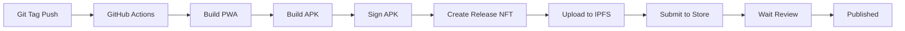

# Solana Mobile dApp Store - Automated Deployment

Bu proje artık GitHub Actions ile otomatik olarak Solana Mobile dApp Store'a deploy edilebiliyor.

## 🚀 Hızlı Başlangıç

### 1. GitHub Secrets Ekle

Repository Settings → Secrets and variables → Actions → New repository secret ile şu secret'ları ekle:

#### Android Build Secrets
```
ANDROID_KEYSTORE_BASE64
  → Android keystore dosyanızın base64 encoded hali
  → Oluşturmak için: cat android.keystore | base64 | pbcopy

KEYSTORE_PASSWORD
  → Keystore şifresi

KEY_ALIAS
  → strun-key (veya oluştururken kullandığınız alias)

KEY_PASSWORD
  → Key şifresi
```

#### Solana Secrets
```
SOLANA_KEYPAIR
  → Solana wallet keypair JSON (publisher olarak kullanılacak)
  → ~/.config/solana/id.json içeriğini kopyala
```

#### Supabase Secrets
```
VITE_SUPABASE_URL
  → https://ysutwfzdpfvziasxbbvn.supabase.co

VITE_SUPABASE_ANON_KEY
  → eyJhbGciOiJIUzI1NiIsInR5cCI6IkpXVCJ9...
```

### 2. Android Keystore Oluştur (İlk Kez)

Eğer henüz keystore oluşturmadıysan:

```bash
# Keystore oluştur
./scripts/create-keystore.sh

# Base64'e çevir
cat android/app/strun-release.keystore | base64 > keystore.base64.txt

# Bu dosyanın içeriğini ANDROID_KEYSTORE_BASE64 secret'ına ekle
```

**ÖNEMLİ:** Keystore dosyasını ve şifrelerini güvenli bir yerde sakla! Kaybedersen uygulamayı güncelleyemezsin.

### 3. Solana Wallet Hazırla

```bash
# Solana CLI kur (yoksa)
sh -c "$(curl -sSfL https://release.solana.com/stable/install)"

# Wallet oluştur veya mevcut olanı kullan
solana-keygen new --outfile ~/.config/solana/id.json

# Public key'i göster
solana-keygen pubkey ~/.config/solana/id.json

# Devnet SOL al (test için)
solana airdrop 2 --url devnet

# Keypair'i GitHub Secret'a ekle
cat ~/.config/solana/id.json
# Bu JSON içeriğini SOLANA_KEYPAIR secret'ına ekle
```

### 4. Deploy Et

#### Otomatik Deploy (Recommended)

Yeni bir version tag'i oluştur:

```bash
git tag v1.0.0
git push origin v1.0.0
```

GitHub Actions otomatik olarak:
1. ✅ APK build eder
2. ✅ Solana dApp Store'a yükler
3. ✅ Review için submit eder
4. ✅ GitHub Release oluşturur

#### Manuel Deploy

GitHub'da Actions sekmesinden "Deploy to Solana Mobile dApp Store" workflow'unu manuel çalıştırabilirsin.

## 📱 Build Edilen APK'ya Erişim

### GitHub Actions Artifact
1. GitHub → Actions → Son başarılı workflow'a git
2. "Artifacts" bölümünden `strun-release-apk` indir

### GitHub Release
Tag push ettiysen:
1. GitHub → Releases
2. Son release'i bul
3. APK'yı indir

## 🔍 Deployment Status Kontrol

### 1. GitHub Actions
- Repository → Actions sekmesi
- Son workflow çalışmasını kontrol et

### 2. Solana dApp Store
- https://dapp-store.solanamobile.com/ adresine git
- Wallet'ı bağla (publisher keypair ile)
- Submitted releases'ı gör

## 📊 Deployment Pipeline



## 🐛 Troubleshooting

### Build Başarısız

**Gradle Build Error:**
```bash
# Local'de test et
npm run build
npx cap sync android
cd android
./gradlew assembleRelease
```

**Keystore Error:**
- ANDROID_KEYSTORE_BASE64 secret'ının doğru olduğundan emin ol
- Şifreleri kontrol et

### Solana Transaction Failed

**Insufficient SOL:**
```bash
# Wallet'a SOL ekle
solana airdrop 2 --url devnet
```

**RPC Error:**
- Workflow'da `--priority-fee 500000` artırılabilir
- Farklı RPC endpoint dene

### APK İmzalama Hatası

Keystore bilgileri yanlış olabilir:
```bash
# Local'de test et
./scripts/build-production-apk.sh
```

## 🔄 Güncelleme Süreci

Her yeni version için:

```bash
# 1. Version'ı güncelle
npm version patch  # veya minor, major

# 2. Tag'i push et
git push origin v1.0.1

# 3. GitHub Actions otomatik devreye girer
```

## 📋 Checklist

İlk deployment öncesi:

- [ ] Android keystore oluşturuldu
- [ ] Keystore base64 secret'a eklendi
- [ ] Solana wallet hazır ve SOL var
- [ ] Keypair secret'a eklendi
- [ ] Supabase credentials doğru
- [ ] `publishing/config.yaml` dolduruldu
- [ ] `publishing/media/` klasöründe görseller var
- [ ] Privacy policy ve support sayfaları hazır
- [ ] Digital Asset Links güncellendi

## 🎯 Production Deployment

Devnet'te test ettikten sonra mainnet'e geçmek için:

1. Workflow dosyasındaki `--url` parametrelerini değiştir:
   ```yaml
   --url https://api.mainnet-beta.solana.com
   ```

2. Production RPC kullan (Helius, QuickNode, etc.)

3. Mainnet SOL ekle (real SOL gerekiyor)

4. Version tag'i ile deploy et

## 📚 Daha Fazla Bilgi

- [Solana Mobile Docs](https://docs.solanamobile.com/)
- [dApp Store Publisher Portal](https://dapp-store.solanamobile.com/)
- [GitHub Actions Docs](https://docs.github.com/en/actions)

## 🆘 Destek

Sorun yaşarsan:
1. GitHub Actions logs'u kontrol et
2. Solana dApp Store review feedback'ini oku
3. Issues açarak yardım iste
